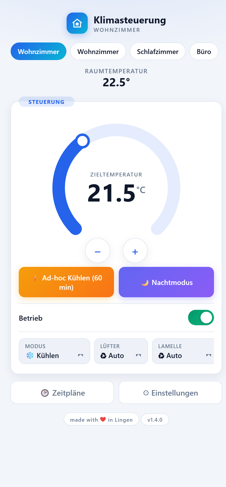
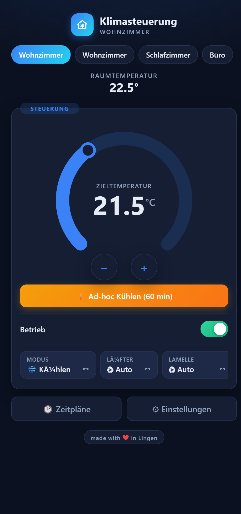
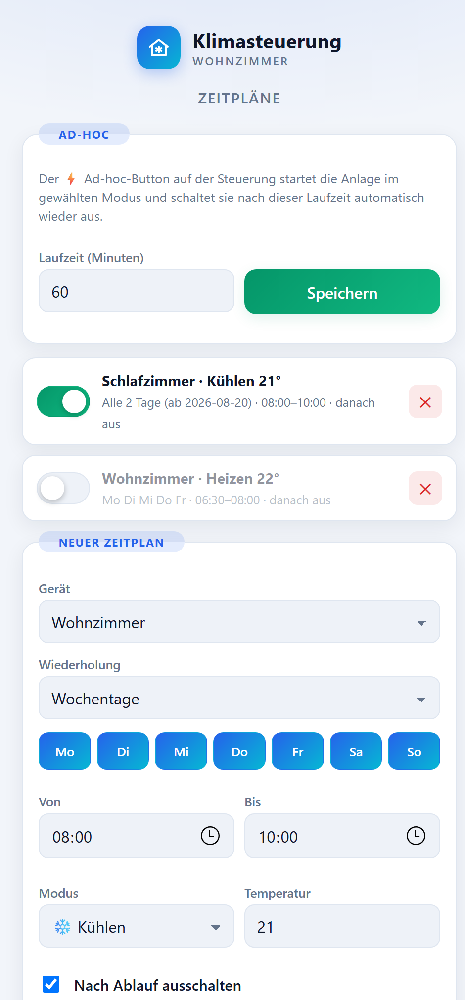
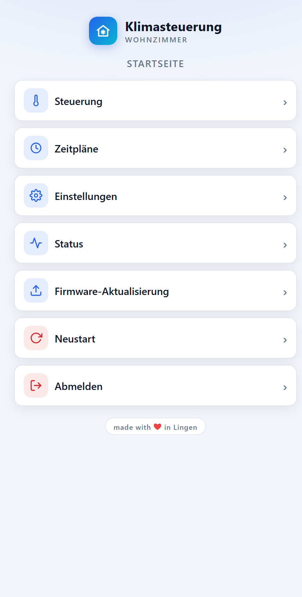
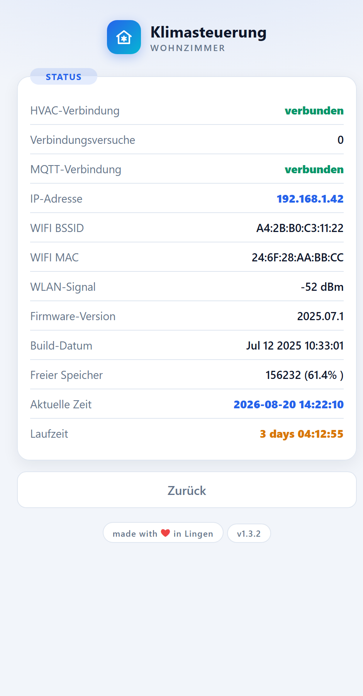

# Klimasteuerung

**Moderne Weboberfläche für Mitsubishi-Klimaanlagen auf ESP32/ESP8266 — mit Mehrgeräte-Steuerung (Master/Slave), Zeitplänen, MQTT und Home-Assistant-Anbindung.**

Basiert auf [dzungpv/mitsubishi2MQTT](https://github.com/dzungpv/mitsubishi2MQTT) — die Klimaanlage wird über den `CN105`-Stecker der Innen­einheit angeschlossen und per WLAN steuerbar.

made with ❤ in Lingen

***

## Screenshots

| Steuerung | Dark Mode | Zeitpläne |
| --- | --- | --- |
|  |  |  |

| Hauptmenü | Status |
| --- | --- |
|  |  |

***

## Features

- **Thermostat-Dial im Home-Assistant-Stil**: Zieltemperatur per Drag am Ring oder über −/+ einstellen, Farbwechsel je nach Modus (Kühlen blau, Heizen orange, Entfeuchten türkis, Auto grün), Live-Updates ohne Neuladen (Server-Sent-Events + Fetch-API)
- **Mehrere Geräte, eine Oberfläche**: Auf einem Gerät (Master) weitere Einheiten per Name + IP hinterlegen (⚙ in der Tab-Leiste) — der Browser steuert die anderen ESPs direkt über deren JSON-API, ohne den Master zu belasten
- **Zeitpläne** (bis zu 8 Regeln, laufen auf dem Gerät selbst — kein Browser nötig):
  - Wochentage (Mo–So) **oder** „alle N Tage" mit Startdatum (z. B. *jeden 2. Tag von 8–10 Uhr Schlafzimmer auf 21° kühlen*)
  - Zeitfenster von/bis, Modus, Zieltemperatur, optional „nach Ablauf ausschalten"
  - Steuert auch die anderen hinterlegten Geräte (per HTTP auf deren API)
- **Modernes Design**: Card-Layout, automatischer Hell-/Dunkelmodus, responsiv für Handy und Desktop, keine externen Ressourcen (funktioniert auch offline im AP-Modus)
- **JSON-API**: `GET /api/status`, `POST /api/control`, `GET|POST /api/devices`, `GET|POST /api/schedules` (CORS-freigegeben)
- Alles Weitere vom Original: Home-Assistant-Autodiscovery, MQTT-Steuerung, OTA-Firmware-Update, Erstkonfiguration per WLAN-Access-Point, Login-Schutz, mehrsprachige Systemseiten

***

## Erste Schritte

1. **Flashen** (einmalig per USB): [esptool-js](https://espressif.github.io/esptool-js/) im Chrome/Edge-Browser öffnen, ESP verbinden und die passende Datei bei Flash-Adresse `0x0` flashen:
   - ESP32: `firmware.factory.bin` (aus `.pio/build/ESP32DEV/`)
   - Wemos D1 Mini / ESP-01: `firmware.bin` der jeweiligen Build-Umgebung
2. **Verbinden**: Nach dem ersten Start öffnet das Gerät ein WLAN namens `HVAC-XXXXXXXXXXXX`. Damit verbinden — das Setup öffnet sich automatisch (sonst `http://192.168.4.1` aufrufen). Tipp: Am Handy vorher die mobilen Daten ausschalten, sonst versucht der Browser die Seite übers Mobilfunknetz zu laden.
3. **Einrichten**: WLAN-Zugangsdaten (und optional MQTT) eintragen, speichern, neu starten. Danach ist das Gerät unter `http://hvac-xxxxxxxxxxxx.local` bzw. seiner IP erreichbar.
4. **Weitere Geräte verbinden**: Auf dem Wunsch-Master unter *Steuerung* → ⚙ die anderen Einheiten mit Name + IP hinzufügen. Danach oben per Tab umschalten.
5. **Zeitpläne**: Im Hauptmenü unter *Zeitpläne* Regeln anlegen. Die Uhrzeit kommt per NTP; Zeitzone und NTP-Server stehen unter *Einstellungen → Sonstiges*.

> ⚠️ **Achtung**: Für den Anschluss muss die Inneneinheit geöffnet werden (`CN105`-Stecker auf der Hauptplatine). Vorher unbedingt die Stromversorgung trennen — unsachgemäßer Umgang kann zu Wasserschäden, Stromschlag oder Brand führen!

> **Hinweis Login**: Ist auf einem Gerät ein Login-Passwort gesetzt, lässt es sich aus Sicherheitsgründen nicht von einem anderen Gerät aus fernsteuern (Cookie-Authentifizierung). Im Heimnetz ohne Gerätepasswörter funktioniert die Mehrgeräte-Steuerung ohne Einschränkung.

***

## Unterstützte Geräte

Grundsätzlich funktioniert jede Mitsubishi-Electric-Inneneinheit mit [`CN105`-Anschluss](hardware/CN105.jpg) auf der Hauptplatine. Eine lange, bestätigte Liste gibt es im [HeatPump-Wiki](https://github.com/SwiCago/HeatPump/wiki/Supported-models).

Als Controller eignen sich **ESP32** (auch S2/S3/C3) und **ESP8266** (Wemos D1 Mini, ESP-01). Anschlussbeispiele und Fotos liegen im Ordner [`hardware/`](hardware/):


- ESP32 nutzt standardmäßig **UART0** (TX GPIO 1, RX GPIO 3); eigene Pins lassen sich unter *Einstellungen → Sonstiges* setzen (dann UART1)
- ESP8266 nutzt die Hardware-Serial

Benötigte Teile für den `CN105`-Stecker: JST **PAP-05V-S** (Gehäuse) + **SPHD-002T-P0.5** (Crimp-Kontakte), alternativ fertige Pigtails (z. B. AliExpress, 5-polig, 2 mm PA-Serie).

***

## Selbst bauen

Das Projekt nutzt [PlatformIO](https://platformio.org/):

```bash
pio run -e ESP32DEV
```

Verfügbare Umgebungen: `ESP32DEV`, `WEMOS_D1_Mini`, `ESP8266-ESP01` (siehe `platformio.ini`).

> **Windows-Tipp**: Falls die ESP32-Toolchain-Installation mit einem Pfadfehler abbricht, das PlatformIO-Verzeichnis auf einen kurzen Pfad legen: `PLATFORMIO_CORE_DIR=C:\pio` (260-Zeichen-Limit).

**UI ohne Hardware entwickeln**: `python tools/webui_preview.py` setzt alle Webseiten aus den C-Templates zusammen und legt sie als HTML in `tools/preview/` ab — einfach im Browser öffnen. Die Oberfläche liegt als eingebettete Strings in `main/htmls/`.

***

## MQTT

Vollständig kompatibel zum Original — Topic-Schema `mqtt_topic/friendly_name/...`:

- `.../power/set`, `.../mode/set`, `.../temp/set`, `.../fan/set`, `.../vane/set`, `.../wide-vane/set`
- `.../state`, `.../debug/logs`, `.../debug/packets`
- `.../system/set` (`restart`, `factory`)

Home-Assistant-Autodiscovery ist eingebaut (Standard-Topic `homeassistant`, änderbar unter *Einstellungen → Sonstiges*). MQTT über TLS (Port 8883) wird auf ESP32 unterstützt.

***

## Danksagung

- [dzungpv/mitsubishi2MQTT](https://github.com/dzungpv/mitsubishi2MQTT) und [gysmo38/mitsubishi2MQTT](https://github.com/gysmo38/mitsubishi2MQTT) — die Basis dieses Projekts
- [SwiCago/HeatPump](https://github.com/SwiCago/HeatPump) — die Bibliothek für das CN105-Protokoll
- Hadley (NZ) für die [ursprüngliche CN105-Analyse](https://web.archive.org/web/20171007190023/https://nicegear.co.nz/blog/hacking-a-mitsubishi-heat-pump-air-conditioner/)

## Lizenz

[GNU Lesser General Public License](LICENSE.md) — wie das Original.
